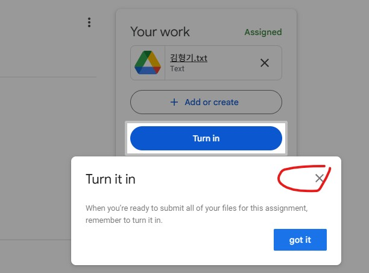

### 과제 제출 방법

#### 0. 과제 파일 생성
- 파일명 : `<본인이름(또는 별명)>.txt` (예 : `김형기.txt`)
#### 1. `Python Basic` Class room url 접속
- url : [https://classroom.google.com/c/ODAxMDMzMDIxMDI1?cjc=xf2jf3nj](https://classroom.google.com/c/ODAxMDMzMDIxMDI1?cjc=xf2jf3nj)
- 수업 참여
 
  

#### 2. 과제 오픈
- 사용 방법 가이드 팝업 화면 닫기

  
- 과제명 `numpy 를 사용하여 video를 편집` 클릭

  
#### 3. 과제 파일 업로드
- 사용 방법 가이드 팝업 화면 닫고 `Add or Create` 버튼 클릭
  
  
- `file` 선택
- `upload` Tab 선택 > `Browse` 버튼 클릭
  
  
- 과제 파일 선택 (예 : `김형기.txt`)
#### 4. 과제 파일 제출
- 사용 방법 가이드 팝업 화면 닫기
  
  
- `Turn in` 버튼 클릭

  